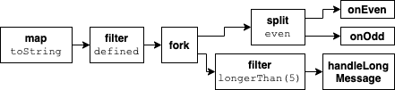

# Different process composition API

## Options
### 1. Chaining processes manually
`Process` is a function that accepts output callback and returns an input callback. This approach is about combining processes manually.

#### Example
```typescript
const callback = map(toString)(filter(defined)(
  fork(
    split(even)([onEven, onOdd]), 
    filter(longerThan(5))(handleLongMessage)
  )
))
```

#### Characteristics
- `+` no helper is needed
- `+` easy to extend
- `-` not very readable
- `-` breaks type inference
- `-` lots of imports

### 2. Chaining within Processes
Processor accepts callback as the second argument, so they can be chained together. 

#### Example
```typescript
const callback = map(toString, filter(defined, 
  fork(
    split(even, [onEven, onOdd]),
    filter(longerThan(5), handleLongMessage)
  )
))
```

#### Characteristics
- `+` no helper is needed
- `+` easy to extend
- `-` not very readable
- `-` lots of imports

### 3. Linking function
A `link` function that combines processors with a handler at the last position and returns the input callback.

#### Example
```typescript
const callback = link(
  map(toString), 
  filter(defined), 
  fork(
    link(split(even), [onEven, onOdd]), 
    link(filter(longerThan(5)), handleLongMessage)
  )
)
```

#### Characteristics
- `+` readable
- `+` easy to extend
- `*` nice symmetry between link and fork as link is for sequential, and fork for paralel execution
- `-` lots of imports
- `-` difficult to type `link` function

### 4. Chaining
Us a builder patter to a chain processes. For the a chain to be finished it needs to have a handler defined at the end.

#### Example
```typescript
const callback = chain
  .map(toString)
  .filter(defined)
  .process(throttle) // custom processor
  .fork(
    chain.split(isEven).handle([onEven, onOdd]), 
    chain.filter(longerThan(5)).handle(handleLongMessage)
  )
```

#### Characteristics
- `+` readable
- `+` single import
- `-` clients will need to write custom wrapper to extend it nicely

#### Implementation

The core chain would support two function, `process` and `handle`.  
```typescript
const callback = chain
  .process(map(toString))
  .process(filter(defined))
  .process(throttle) // custom processor
  .handle(fork(
    chain.process(split(isEven)).handle([onEven, onOdd]), 
    chain.process(filter(longerThan(5))).handle(handleLongMessage)
  ))
```

##### Naming
It is important to have good name for these two functions.

processing: `process` long but nice that correspond to processors, `pass`, `do`, `work` \
handling: `handle`, `then` too similar to promises,

##### Extending
However, there would be chain extension allowing to add aliases for commonly used functions
```typescript

interface Chain {
  map: () => Chain // processors continue the chain
  fork: () => void // handlers terminate the chain
}

const chain = (): Chain => {
  const chainBuilder = newChainBuilder()
  return {
    map: (f) => {
      chainBuilder.process(f)
      return this
    },
    fork: (handlers) => {
      chainBuilder.handle(fork(handlers))
    }
  }
}
```

## Other representations
Processes composition should be static, therefore the composition could be represented, outside runtime environment, in static file formats or even visually.

### JSON
```json
[
  {
    "id": 1,
    "type": "map",
    "config": {
      "function": "toString"
    },
    "output": 2
  },
  {
    "id": 2,
    "type": "filter",
    "config": {
      "function": "defined"
    },
    "output": 3
  },
  {
    "id": 3,
    "type": "fork",
    "outputs": [
      4,
      7
    ]
  },
  {
    "id": 4,
    "type": "split",
    "config": {
      "function": "even"
    },
    "outputs": [
      5,
      6
    ]
  },
  {
    "id": 5,
    "type": "handler",
    "config": {
      "function": "onEven"
    }
  },
  {
    "id": 6,
    "type": "handler",
    "config": {
      "function": "onOdd"
    }
  },
  {
    "id": 7,
    "type": "filter",
    "config": {
      "function": "longerThan",
      "args": [5]
    },
    "output": 3
  },
  {
    "id": 8,
    "type": "handler",
    "config": {
      "function": "handleLongMessage"
    }
  }
]
```

### Visualised diagram

